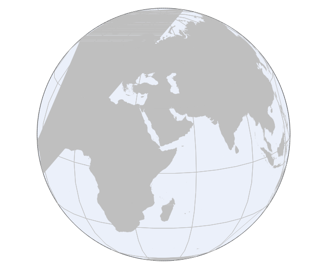
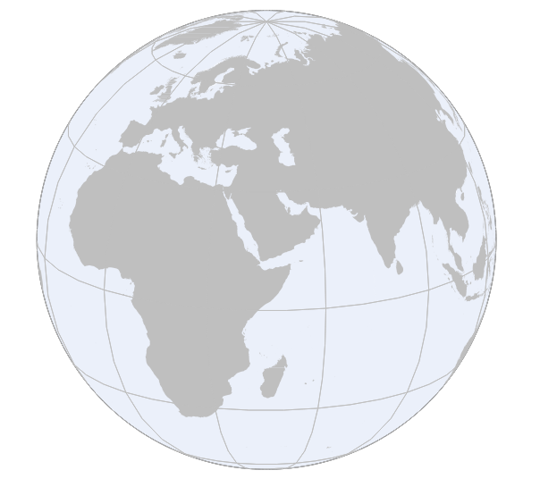

# Clip-to-Hemisphere-QGIS3
A QGIS3 Script tool preparing data for custom orthographic projections.  
The script have been developed based on an algorithm from <a href = 'https://github.com/jdugge/ClipToHemisphere'>Juernjakob Dugge (2016)</a>.

In QGIS, some features may not not be drawn properly on <strong>orthographic projections</strong>. For example, the picture below shows some misrepresentation on the west of the globe.  
 
The misrepresentation on orthographic projections might be fixed by two appoaches: disabling the QGIS automatic symplification and cliping the layer to hemishere, where the centre is at the origin of the orthographic projection. The following picture shows the layer cliped by the tool projected on an othographic projection.  

## Requirements
This script has been tested on QGIS 3.4 only, however; this would probably work with QGIS 3.X

## Installation
At the processing toolbox panel, click on the Sciprt button --> Add Script to Toolbox....

## Usage
1. select your vector layer as your 'Input'.
2. specify centre 'latitude and longitude of centre of your hemisphere' as your orthographic projection origin
3. you may need to specify 'Number of segments for approximating the hemisphere. Higher number can get finer results but require longer processing time.
4. select your output directory and click run

## Changelog
0.1 - first version
